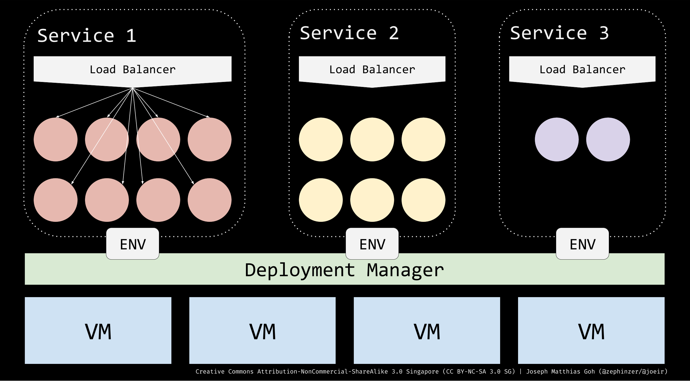
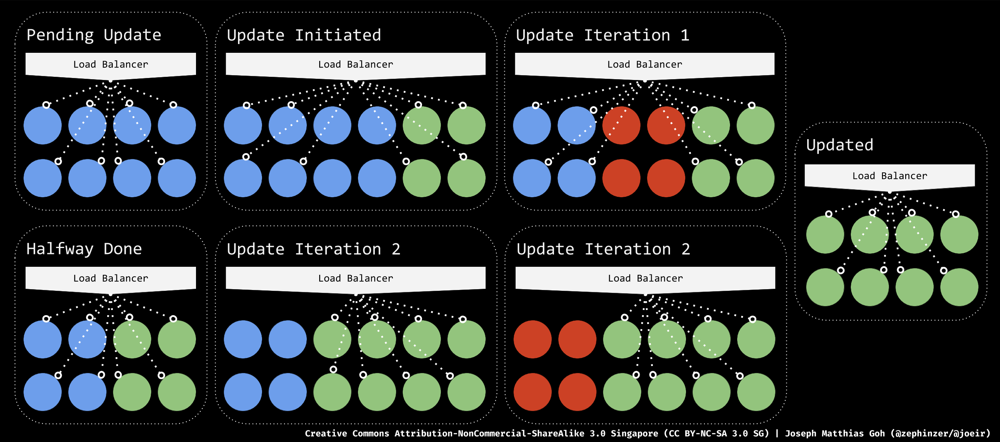

<!-- .slide: class="center" data-background="./cicdjs-front-splash.jpg"  -->
# Continuously Delivering Full-Stack JavaScript
#### talk.js november 2017 meetup
___
<!-- .slide: class="center" -->

#### joseph matthias goh

<table>
  <tr>
    <td>
      <i class="fa fa-info-circle"></i>
    </td>
    <td>
      <small>
        Software & DevOps/Ops Engineer specialising in full-stack web development  
      </small>
    </td>
  </tr>
  <tr>
    <td>
      <i class="fa fa-briefcase"></i>
    </td>
    <td>
      <small>
        Government Digital Services, GovTech Singapore
      </small>
    </td>
  </tr>
  <tr>
    <td>
      <i class="fa fa-envelope"></i>
    </td>
    <td>
      <small>
        <i class="fa fa-briefcase"></i> | <a href="mailto:joseph_goh@tech.gov.sg" target="_blank">joseph_goh@tech.gov.sg</a> (business)  
        <i class="fa fa-comment"></i> | <a href="mailto:hello@joeir.net" target="_blank">hello@joeir.net</a> (pleasure)  
        <i class="fa fa-github" style="font-size: 1.18em;"></i> | <a href="https://github.com/zephinzer" target="_blank">zephinzer</a> (stalking)
      </small>
    </td>
  </tr>
  <tr>
    <td>
      <i class="fa fa-gavel"></i>
    </td>
    <td>
      <small>
        [Attribution-NonCommercial-ShareAlike 3.0 Singapore](https://creativecommons.org/licenses/by-nc-sa/3.0/sg/)  
        [GitHub Repository Link](https://github.com/zephinzer/continuously-delivering-full-stack-javascript)
      </small>
    </td>
  </tr>
</table>

_____
<!-- .slide: class="center" data-background="./why-you-should-listen-l.jpg"  -->
# why you should listen

___
<!-- .slide: class="center" -->
if code is written but never deployed, was it ever really written?
___
## got that one big idea?

- code written
- tests passing
- then what?

___
## my story

- music & entertainment startup
- stage was set and ready to go
- a crowd of about 100
- web app was deployed
- at the point of transaction...

___

<!-- .slide: class="center" -->
~10s page load timing

<small>(hint: 5s is infinity in internet time)</small>

___
<!-- .slide: class="center" -->
don't be like me

___
## good delivery methodologies

- improve business agility
  - constant iterative improvements
  - frequent updates
- reduce potential for business losses
  - low/no downtime
- enhance user experience
  - quick page loads

___
## the value chain beyond full stack

<!-- .class="icon" -->


- software architects
  - 13,737 jobs / 281,179 talents (~4%)
- software engineers
  - 362,957 jobs / 3,225,025 talents (~11%)
- front end developers
  - 23,752 jobs / 121,741 talents (~19%)
- full stack developers
  - 21,817 jobs / 82,875 talents (~26%)

___
## the value chain beyond full stack

<!-- .class="icon" -->


- devops engineers
  - 50,516 jobs / 49,095 talents
- ops engineers
  - 2,746 jobs / 19,427 talents
- devops/ops engineers
  - 53,262 jobs / 68,522 talents (~78%)
___
<!-- .slide: class="center" -->
oh, and one more thing...


we're hiring for devops/ops
_____
<!-- .slide: class="center" data-background="./continuous-delivery-l.jpg"  -->
# continuous delivery

___
<!-- .slide: class="center" -->
getting the goods to the user, consistently
___
## agile development

- iterative development methodology
  - **business objectives**
  - **user stories**
  - **development work**
  - **delivery**
  - **user feedback**
  - **improvement**
- change is the only const


___
## technical concerns

- development work
- build, test, release & deploy
- - -
- enable frequent deployments to production
- reduce time taken to production
- reduce human intervention during deployment

___
## ci/cd pipeline

- triggered on commit push by developers
  - automated **build**ing
  - automated **test**ing
  - automated **release**
  - automated **deploy**ment

```nonsense
 .----------------------------------------.
 | CODE | BUILD | TEST | RELEASE | DEPLOY |
 .----------------------------------------.
        |             AUTOMATE            |
        \---------------------------------/
```

- **input &nbsp;: code commit**
- **output : deployment(s)**
_____
<!-- .slide: class="center" data-background="./about-deployments-l.jpg"  -->
# about deployments

___
<!-- .slide: class="center" -->
what it is and what it isn't

___
## deployment

- exposes high level features
  - snapshot of the codebase (aka a release)
  - reference by hash    : 0f1bc668
  - reference by version : v1.12.397

```nonsense
* master (HEAD)
| - bc18a01f             -------------
| - 0f1bc668 ---------> | APPLICATION |
| - 01c2b3d4            | INSTANCE(S) |
| - dd66bc92             -------------
| ...
```
___
## deployment

- configures behaviour of the application
  - application service global variables (eg NODE_ENV)
  - backing services connector configurations
  - admin services schedules

```nonsense
  --------------- -------> - 0 5 * * * knex migrate
 | APPLICATION   |  |      - 0 6 * * * knex seed
 | @ 10.11.12.13 |  |      - ...    
  ---------------   |       
  |                 -> - DB_HOST               
  -> - NODE_ENV        - DB_PORT 
     - PATH            - ...
     - ...
```

___
## deployment

- targets specific users/stakeholders
  - resource locator (eg. https://dev.myapp.com)

```nonsense
  ---------------                             
 | APPLICATION   |     GET / HTTP/1.1           0
 | @ 10.11.12.13 | <-- host: dev.myapp.com <-- /|\
  ---------------                               | 
                            { developers } --> / \
 - - - - - - - - - - - - - - - - - - - - - - - - - -
  ---------------                             
 | APPLICATION   |     GET / HTTP/1.1           0
 | @ 10.11.12.14 | <-- host: uat.myapp.com <-- /|\
  ---------------                               | 
                        { product owners } --> / \
```

___
## deployment

- defines infrastructure & availability
  - what base system should be used?
  - how many vm instances should be running?
  - blue-green deployment parameters?

```nonsense
    (instance 1)        (instance 2)       (instance 3)
  ------------------ - - - - - - - - -  - - - - - - - - -
 | APPLICATION_01i1 | APPLICATION_01i2 | APPLICATION_01i3 |
 | @ 10.11.12.13    | @ 10.11.12.13      @ 10.11.12.14    
 | - node:6.11.4    | - node:6.11.4    | - node:6.11.4    |
  ------------------ - - - - - - - - -  - - - - - - - - - 
  ------------------ - - - - - - - - -  - - - - - - - - -
 | APPLICATION_02i1 | APPLICATION_02i2 | APPLICATION_02i3 |
 | @ 10.11.12.13    | @ 10.11.12.14      @ 10.11.12.15    
 | - node:8.9.1     | - node:8.9.1     | - node:8.9.1     |
  ------------------ - - - - - - - - -  - - - - - - - - - 
```
___
## deployment
#### what it looks like (I)

___
## deployment
#### what it looks like (II)

___
## deployment
#### what it is not

- is **not** the environment
  - avoid correlating environments with deployments
  - correlate environments with product behaviour
- is **not** just production
  - deploy to dev after successful build
  - deploy to qa after unit/system tests
  - deploy to uat after integration tests
  - deploy to staging after non-functional tests
  - deploy to production after staging is successful
___
## deployment
#### common tools
<table>
  <tr>
    <td>
      VMs
    </td>
    <td>
      Containers
    </td>
    <td>
      Services
    </td>
  </tr>
  <tr>
    <td>
      <small>
      [pm2](https://github.com/Unitech/pm2)  
      [foreman](https://github.com/strongloop/node-foreman)  
      [nodemon](https://github.com/remy/nodemon)  
      [vagrant](https://www.vagrantup.com/)  
      </small>
    </td>
    <td>
      <small>
      [docker](https://www.docker.com/)  
      [pm2-docker](http://pm2.keymetrics.io/docs/usage/docker-pm2-nodejs/)  
      [docker compose](https://github.com/docker/compose)  
      [docker swarm](https://github.com/docker/swarm)  
      [kubernetes](https://kubernetes.io/)  
      </small>
    </td>
    <td>
      <small>
      [heroku](https://www.heroku.com/)  
      [red hat openshift (os)](https://www.openshift.com/)  
      [google container engine (gke)](https://cloud.google.com/kubernetes-engine/)  
      [aws elastic container service (ecs)](https://aws.amazon.com/ecs/)  
      [azure container service (acs?)](https://azure.microsoft.com/en-us/services/container-service/)  
      </small>
    </td>
  </tr>
</table>
_____
<!-- .slide: class="center" data-background="./how-we-did-it-l.jpg"  -->
# how we did it
___
<!-- .slide: class="center" -->
something that, well, has worked (so far)
___
## application architecture
#### front-end
- react.js
- website application

#### back-end
- express/swagger
- web api application
___
<!-- .slide: class="center contain" data-background="./mcfcd-overview.png"-->

_____
<!-- .slide: class="center" -->
# objectives

allow developers to push often  
deploy easily & frequently  
reduce time to production  
_____
<!-- .slide: class="center" data-background="./deployment-friendly-javascript-l.jpg"  -->
# development
___
<!-- .slide: class="center" -->
writing deployment-friendly javascript
___
## codebase management
#### one codebase; many deploys

- one ci pipeline per application
- customised build/test/release process
- no single point of failure
___
## dependency mangement
#### isolate `devDependencies`

- `"dependencies"` for production
- `"devDependencies"` for development
- prepare `"devDependencies"` to be excluded from production builds
- use `'npm install --dev'` to add a `"devDependencies"` entry
___
## dependency mangement
#### lazy-load `devDependencies`
- <span style="color:#F00">**negative**</span> example:

```javascript
const devDependency = require('dev-dependency');

if ( NODE_ENV === 'development' ) {
  const x = devDependency();
}
```

- <span style="color:#0F0">**positive**</span> example:

```javascript
if ( NODE_ENV === 'development' ) {
  const devDependency = require('dev-dependency');
  const x = devDependency();
}
```
___
## dependency mangement
#### use a lockfile

- npm 5 comes with package-lock.json
- yarn comes with yarn.lock
- standardises dependency version
- no 'it works on my machine'
___
## environment management
#### keep configuration out of the code (I)

- use process.env.* to reference configurations
- <span style="color:#F00">**negative**</span> example:

```javascript
if (process.env.NODE_ENV === 'development')
  server.listen(3000);
else
  server.listen(4000);
```

- <span style="color:#0F0">**positive**</span> example:

```javascript
server.listen(process.env.PORT);
```
___
## environment management
#### keep configuration out of the code (II)
- .env file using `dotenv` npm package
  ```yaml
  NODE_ENV=development
  ```
- docker compose and kubernetes for deployments
___
## environment management
#### keep configuration out of the code (III)
- an exception is for inclusion of development tools:

```javascript
if ( process.env.NODE_ENV === 'development' ) {
  const webpackHotMiddleware = require('webpack-hot-middleware');
  server.use(webpackHotMiddleware);
}
```
___
## environment management
#### minimise dev/prod parity

- reduce number of environments to 2, `dev` and `prod`
- keep logical code execution as similar as possible
___
## environment management
#### services as attached resources
- code always remains the same

```javascript
const {DB_ADAPTER} = process.env;
const DB = require(DB_ADAPTER);
module.exports = new DB({
  hostname: process.env.DB_HOSTNAME,
  username: process.env.DB_USERNAME,
  password: process.env.DB_PASSWORD
})
```

- configure `DB_*` via environment
  - `dotenv` / docker compose / kubernetes
___
## persistent data management
#### version the data schema (I)

- use database migrations
- incremental schema changes specified in code
  - READ: versionable/predictable - whatever's in the migrations defines the current state of the database

```javascript
exports.up = function(knex, Promise) { /* ... */ };
exports.down = function(knex, Promise) { /* ... */ };
```
___
## persistent data management
#### version the data schema (II)

- current tools of the trade:
  - knex (*query builder*)
  - sequelize (*object relational mapper*)

```javascript
knex.schema.createTable('profile', (table) => {
  table.increments();
  table.string('username');
  table.integer('visits');
  table.dateTime('lastVisit');
  table.enum('gender', ['male', 'female'])
  table.timestamps();
});
```
___
## process management
#### keep the application stateless

- avoid file i/o operations
  - eg PID file
- avoid multiple service connections to same service
___
## process management
#### singleton pattern for service connection

- one instance, one connection
- scale via the process model
- promotes faster graceful shutdowns

```javascript
_instance = null;

module.exports = function() {
if ( _instance === null ) {
  _instance = new ServiceAdpater({/* config */});
}
return _instance;
}
```
___
## process management
#### stateless authentication

- prefer jwt over sessions
- use external service to 'remember' sessions
  - eg. redis, mongo
___
## process management
#### log everything, and log to stdout

- keeps application stateless (no files)
- allows for logs to be collated by process manager/container orchestrator
- do logs filtering from logs collator
___
## in summary
<small>
one codebase; one application  
isolate & lazy-load `devDependencies`  
use a lockfile for dependencies  
keep configuration out of the code  
version your data schema  
.listen() as soon as possible  
use stateless authentication methods  
one service connection per application instance  
log to stdout
</small>
_____
<!-- .slide: class="center" data-background="./building-l.jpg"  -->
# building
___
<!-- .slide: class="center" -->
include what's needed and let that be enough  

<small>
(and be snappy about that)
</small>
___
## build management
#### build in encapsulated environments
- binaries may differ across operating systems
- use a `Dockerfile`
```dockerfile
FROM org/image:versionTag
ENV NODE_ENV="production"
WORKDIR /app
COPY ./package.json /app/package.json
RUN npm run build
```
___
## dependency optimisation
#### version your dependencies (I)
- hastens builds
- hash the lockfile/package.json for the dependency version
- reuse if it already exists

```bash
HASH="$(md5 ./yarn.lock)$(md5 ./package.json)";
docker pull registry.com/namespace/dependencies:${HASH};
if [ "$?" != '0' ]; then
  docker build
    --file dev-dependencies.Dockerfile
    --tag registry.com/namespace/dependencies:${HASH} .;
  docker push registry.com/namespace/dependencies:${HASH};
fi;
```
___
## dependency optimisation
#### version your dependencies (II)
- dependency building dockerfile
  ```dockerfile
  FROM zephinzer/alpine-node:v8.9.1
  WORKDIR /app
  COPY ./package.json /app/package.json
  COPY ./yarn.lock /app/yarn.lock
  RUN npm install [--production]
  ```
- dockerfile for application build
```dockerfile
ARG HASH="latest"
FROM registry.com/namespace/dependencies:${HASH}
WORKDIR /app
COPY . /app
RUN ...
```
___
## code optimisation
#### code compression
- minimises code size
- read more: [uglifyjs-webpack-plugin](https://github.com/webpack-contrib/uglifyjs-webpack-plugin)

```javascript
plugins: [
  ...,
  new UglifyJsPlugin({
    include: /\/src/
  }),
],
```
___
## code optimisation
#### bundle compression
- minimises file size
- read more: [compression-webpack-plugin](https://github.com/webpack-contrib/compression-webpack-plugin)

```javascript
plugins: [
  ...,
  new CompressionPlugin({
    algorithm: gzip,
    minRatio: 0.6
  }),
],
```
___
## code optimisation
#### code splitting (I)
- faster page load timings
- dependencies/development code splits
- feature level code splits
- read more: [`CommonChunksPlugin`](https://webpack.js.org/plugins/commons-chunk-plugin/)
___
## code optimisation
#### code splitting (II)
- node_modules hardly changes, add them to a 'common chunk'

```javascript
entry: {
  ...,
  vendor: ["./node_modules"],
},
plugins: [
  ...,
  new webpack.optimize.CommonsChunkPlugin({
    name: "vendor",
    minChunks: Infinity,
  }),
],
```
___
## code optimisation
#### client-side caching (I)
- improve page load times
- use service worker precache by google
- cache code bundles/static assets
- read more: [sw-precache-webpack-plugin](https://github.com/goldhand/sw-precache-webpack-plugin)
___
## code optimisation
#### client-side caching (II)

- file changes to any paths inside `staticFileGlobs` will bust the cache

```javascript
plugins: [
  ...,
  new SWPrecacheWebpackPlugin({
    cacheId: 'projectId',
    filename: 'sw.js',
    staticFileGlobs: [
      './static/*',
      /* other paths to files intended for caching */
    ],
    mergeStaticsConfig: true,
  }),
],
```
___
## code optimisation
#### client-side caching (III)

- using `sw-precache-webpack-plugin' in the front-end

```javascript
(function() {
  if('serviceWorker' in navigator) {
    navigator.serviceWorker.register('/sw.js');
  }
})();
```
___
## summary
<small>
version dependencies for re-use  
minify and optimise code  
compress file size of bundle  
split code by change frequency  
split code by features  
client-side caching
</small>
_____
<!-- .slide: class="center" data-background="./automated-testing-l.jpg"  -->
# automated testing
___
<!-- .slide: class="center" -->
prevent things from breaking  
when moving too quickly
___
## code management
#### static analysis (I)
- improve readability, control complexity
- eslint
- google-config for general javascript
  - read more: [eslint-config-google](https://github.com/google/eslint-config-google)
- airbnb-config for react.js
  - read more: [eslint-config-airbnb](https://github.com/airbnb/javascript)
___
## code management
#### static analysis (II)
- prevent security breaches
- scanjs-config for security vulnerabilities
  - read more: [eslint-config-scanjs](https://github.com/mozfreddyb/eslint-config-scanjs)
  - read more: [eslint-plugin-scanjs-rules](https://github.com/mozfreddyb/eslint-plugin-scanjs-rules)
___
## code management
#### static analysis (III)
- implement it via `.eslintrc.json`
  ```javascript
  {
    "extends": [
      "google", // OR
      "airbnb"
    ],
    "plugins": [
      "scanjs-rules"
    ]
  }
  ```
___
## functional verification
#### unit/system tests
- ensures basic code blocks work
- mocha framework
- karma runner for front-end

___
## functional verification
#### integration tests (I)
- end to end testing to verify user journey fulfilment
- codecept.js acceptance testing
  - read more: [codeceptjs](https://github.com/codeception/codeceptjs/)
- robot test framework
  - read more: [robot](https://github.com/robotframework/robotframework)
___
## functional verification
#### integration tests (II)
- human point-of-view tests
  ```javascript
  Feature('User Onboarding');

  Scenario('From Facebook', (I) => {
    I.amOnPage('/?utm_campaign=facebook');
    I.see('Login via Facebook');
    I.click('Login via Facebook');
    I.amOnPage('/register/facebook');
  });
  ```
___
## non-functional verification
- estimate load-accepting capacity
- gatling load testing
  - read more: [gatling](https://github.com/gatling/gatling)
- prevent security vulnerabilities
- w3af pen testing
  - read more: [w3af](https://github.com/andresriancho/w3af)
___
## summary
<small>
  code maintainability  
  code level security  
  unit and system tests  
  integration tests  
  load tests  
  penetration tests
</small>
_____
<!-- .slide: class="center" data-background="./release-l.jpg"  -->
# releasing
___
<!-- .slide: class="center" -->
crafting well-defined deployments
___
## version management
#### use semver

- semver standard

```nonsense
   X  .  Y  .  Z
   ^     ^     ^
   |     |     \-> patch version
   |     \-> minor version
   \-> major version
```

- patch version for bug fixes
- minor version for non-breaking changes
- major version for breaking changes
___
## version management
#### avoid package.json

- avoid modifying code when automating the versioning
- adds a useless 'version bump' commit
- every push == requires a pull
- solution: use codebase meta data such as git tags

___
## version management
#### using git tags (I)

- add a git tag with:
  ```bash
  git tag 1.0.0
  ```
- view git tags with:
  ```bash
  git tag --list
  ```
- query latest tag with:
  ```bash
  git describe --abbrev=1 --tags
  ```
- delete a tag with:
  ```
  git tag -d 1.0.0
  ```
___
## version management
#### using git tags (II)
- initialize your repository:
  - ./versioning-tagging-scripts/init -q
- get the latest tag:
  - ./versioning-tagging-scripts/get-latest -q
- iterate upwards with:
  - ./versioning-tagging-scripts/iterate patch -q -i
  - ./versioning-tagging-scripts/iterate minor -q -i
  - ./versioning-tagging-scripts/iterate major -q -i
- read more: [github.com/zephinzer/version-tagging-scripts](https://github.com/zephinzer/version-tagging-scripts)
___
## package management
#### using docker for immutability
- create a `Dockerfile` to package the application
  ```
  FROM zephinzer/alpine-node:latest
  WORKDIR /app
  COPY . /app
  RUN yarn build
  ```
- build and tag it with the semver version
  ```bash
  docker build
    --file /path/to/Dockerfile
    --tag registry.com/repo/app:${VERSION} .;
  docker push registry.com/repo/app:${VERSION};
  ```

___
## summary
<small>
use semver  
avoid package.json  
use git tags  
package immutably
</small>
_____
<!-- .slide: class="center" data-background="./deploying-l.jpg"  -->
# deploying
___
<!-- .slide: class="center" -->
getting it out there and ensuring  
it stays up
___
## infrastructure as code
- empowers developers
- devops/ops as a shared responsibility
- using k8s, we can deploy with:
  ```bash
  kubectl apply -f ./specfile.yml
  ```
___
## infrastructure as code
#### base system definition
- specify this in `Dockerfile`
```dockerfile
FROM system-name:${VERSION}
...
```
___
## infrastructure as code
#### deploying with k8s (I)
- creating a deployment on kubernetes using specfile
  ```yaml
  kind: Deployment
  spec:
    template:
      spec:
        containers:
        - name: application-name
          image: registry.com/repo/app:latest
          imagePullPolicy: Always
          ports:
          - containerPort: 3000
  ```
___
## infrastructure as code
#### deploying with k8s (II)
- injecting environment through the specfile
  ```yaml
  kind: Deployment
  spec:
    template:
      spec:
        containers:
        - env:
          - name: NODE_ENV
            value: production
          - name: DB_HOST
            value: example.rds12345.amazonaws.com
  ```
___
## infrastructure as code
#### deploying with k8s (III)
- scaling via the process model
- specifying availability parameters on kubernetes using specfile
  ```yaml
  kind: Deployment
  spec:
    replicas: 30
    strategy:
      type: RollingUpdate
      rollingUpdate:
        maxUnavailable: 15
        maxSurge: 15
  ```
___
## infrastructure as code
#### deploying with k8s (IV)
- expose your application via port binding
- exposing deployment on kubernetes using specfile
  ```yaml
  kind: Service
  spec:
    ports:
    - name: https
      port: 443
      protocol: TCP
      targetPort: 3000
  ```
___
## service management
#### three types
- application service
  - your application
- backing services
  - databases, key-value stores
- administrative services
  - data synchronisors, schema updaters
___
## service management
#### application/backing services
- use the `Deployment` specfile
- deploy as shown in prevous slides
___
## service management
#### administrative services
- use the `CronJob` specfile
```yaml
kind: CronJob
spec:
  schedule: "0 5 * * *"
  jobTemplate:
    spec:
      template:
        containers:
        - name: database-schema-updater
          image: registry.com/repo/app:latest
          args:
          - npm
          - run
          - migrations
```
___
## configure for quantity
- node is single threaded, scale out for concurrency
- spin up many instances, let them die on...

- - -
memory leaks  
*its not a matter of if, but when*
- - -
___
## configure for quantity
#### setting memory bounds on k8s
- use the `resources` property in the specfile
  ```yaml
  kind: Deployment
  spec:
    template:
      spec:
        replicas: 50
        containers:
        - resources:
            limits:
              cpu: "150m"
              memory: "200Mi"
            requests:
              cpu: "100m"
              memory: "150Mi"
  ``` 
___
## summary
<small>
define base system with docker  
define infrastructure with kubernetes  
`Deployment`s for backing/app services  
`Service`s for exposing `Deployment`s  
`CronJob`s for admin services  
focus on quantity when scaling  
let memory leaks die  
</small>
___
<!-- .slide: class="center" -->
## don't deploy on fridays
<small>
(friends don't let friends deploy on fridays)
</small>
_____
<table style="margin-top:-20px;width:100%">
  <tr>
    <td style="text-align:center;width:50%">
      <h1>thank you</h1>
      <small>
      terima kasih  
      谢谢  
      ขอขอบคุณ  
      धन्यवाद  
      cảm ơn bạn  
      ありがとうございました  
      고맙습니다  
      danke  
      tack  
      je vous remercie  
      grazie  
      </small>
    </td>
    <td style="text-align:center;width:50%;">
      <h4>
        got feedback?
      </h4>
      
      <small>
        <small>
          https://goo.gl/forms/GjW2cXfcJqRPqben1
        </small>
      </small>
    </td>
  </tr>
</table>
<table style="margin-top:-24px;">
  <tr>
    <td>
      <i class="fa fa-2x fa-envelope"></i>
    </td>
    <td>
      <small>
        **iam: joseph matthias goh**  
        <i class="fa fa-briefcase"></i> | <a href="mailto:joseph_goh@tech.gov.sg" target="_blank">joseph_goh@tech.gov.sg</a> (business)  
        <i class="fa fa-comment"></i> | <a href="mailto:hello@joeir.net" target="_blank">hello@joeir.net</a> (pleasure)  
        <i class="fa fa-github" style="font-size: 1.18em;"></i> | <a href="https://github.com/zephinzer" target="_blank">zephinzer</a> (stalking)
      </small>
    </td>
  </tr>
</table>